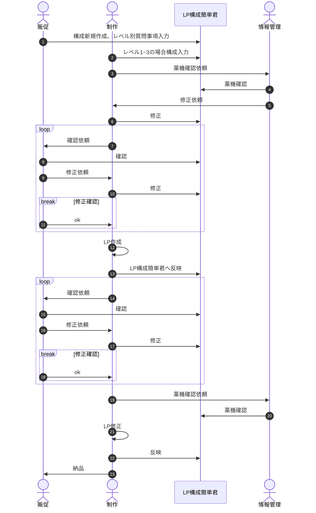
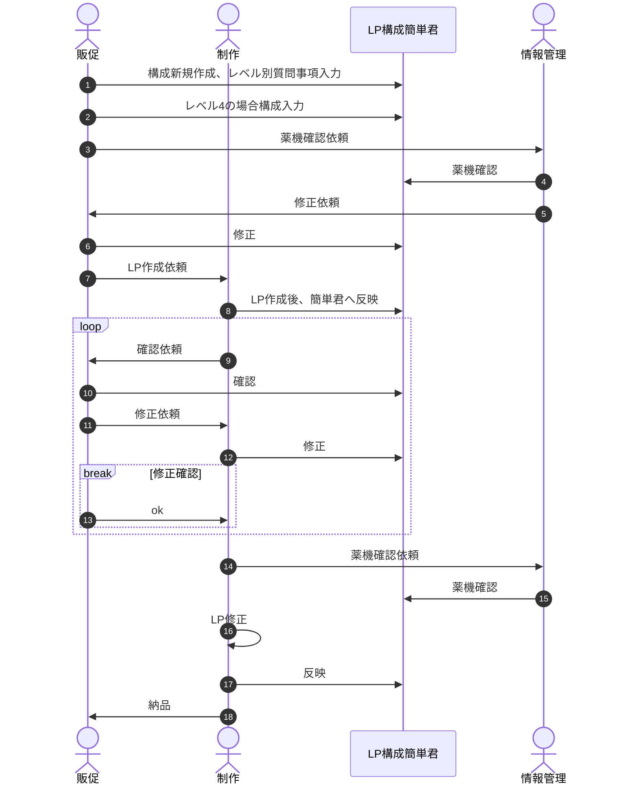

# 業務フロー

## レベル1~3

```mermaid
sequenceDiagram
autonumber
actor hansoku as 販促
actor seisaku as 制作
participant LP as LP構成簡単君
actor joho as 情報管理

hansoku ->> LP: 構成新規作成、レベル別質問事項入力
seisaku ->> LP: レベル1~3の場合構成入力
seisaku ->> joho: 薬機確認依頼
joho ->> LP: 薬機確認
joho ->> seisaku: 修正依頼
seisaku ->> LP: 修正
loop
seisaku ->> hansoku: 確認依頼
hansoku ->> LP: 確認
hansoku ->> seisaku: 修正依頼
seisaku ->> LP: 修正
    break 修正確認
        hansoku ->> seisaku: ok
    end
end
seisaku ->> seisaku: LP作成
seisaku ->> LP: LP構成簡単君へ反映
loop
seisaku ->> hansoku: 確認依頼
hansoku ->> LP: 確認
hansoku ->> seisaku: 修正依頼
seisaku ->> LP: 修正
    break 修正確認
        hansoku ->> seisaku: ok
    end
end
seisaku ->> joho: 薬機確認依頼
joho ->> LP : 薬機確認
seisaku ->> seisaku: LP修正
seisaku ->> LP: 反映
seisaku ->> hansoku: 納品

```

## レベル4

```mermaid
sequenceDiagram
autonumber
actor hansoku as 販促
actor seisaku as 制作
participant LP as LP構成簡単君
actor joho as 情報管理

hansoku ->> LP: 構成新規作成、レベル別質問事項入力
hansoku ->> LP: レベル4の場合構成入力
hansoku ->> joho: 薬機確認依頼
joho ->> LP: 薬機確認
joho ->> hansoku: 修正依頼
hansoku ->> LP: 修正
hansoku ->> seisaku: LP作成依頼
seisaku ->> LP: LP作成後、簡単君へ反映
loop
seisaku ->> hansoku: 確認依頼
hansoku ->> LP: 確認
hansoku ->> seisaku: 修正依頼
seisaku ->> LP: 修正
    break 修正確認
        hansoku ->> seisaku: ok
    end
end
seisaku ->> joho: 薬機確認依頼
joho ->> LP : 薬機確認
seisaku ->> seisaku: LP修正
seisaku ->> LP: 反映
seisaku ->> hansoku: 納品

```
---

## 備考
- サプリ、OFSの新商品の場合、LP構成簡単君の入力～LP作成まで全てを制作事業部が行う場合もある
- 東京OFS商品の場合、東京OFS事業部でLP構成簡単君の入力を全て行う
  - 制作事業部にお任せする場合もある
- 攻めた販促画像などを使わない場合、薬機確認を制作事業部リーダーが行う場合もある