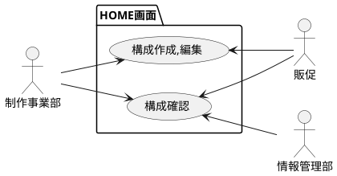
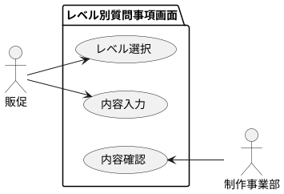
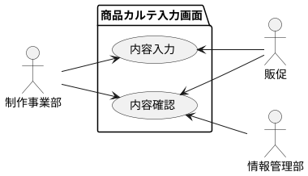
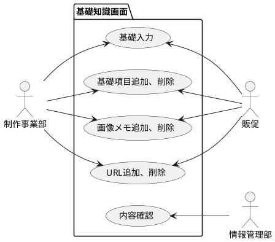
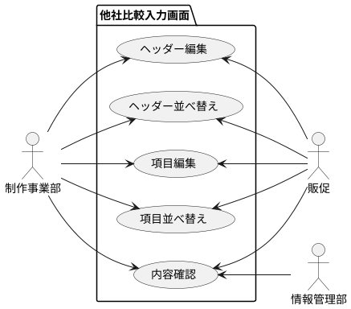
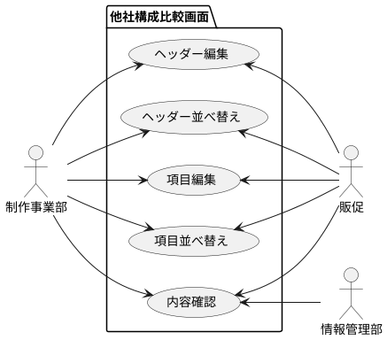
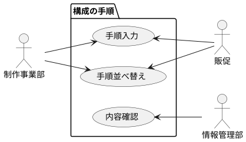
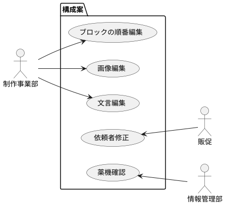
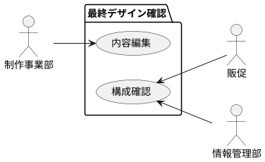

# ユースケース図

### 変更履歴

| ver   | 日付       | 概要 |
| :---- | :--------- | :--- |
| 1.0.0 | 2023-11-07 | 初版 |

## HOME画面

## レベル別質問事項画面

## 商品カルテ入力画面

## 基礎知識画面

## 他社比較入力画面

## 他社構成比較画面

## 構成の手順

## 構成案

## 最終デザイン確認

## 備考
