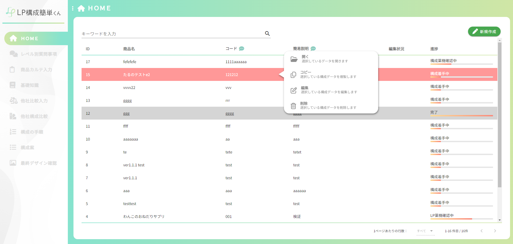
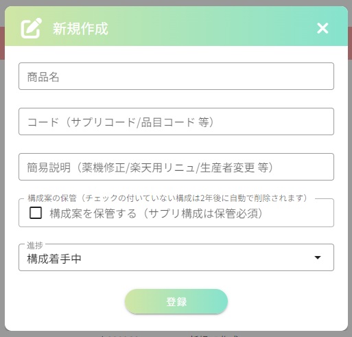
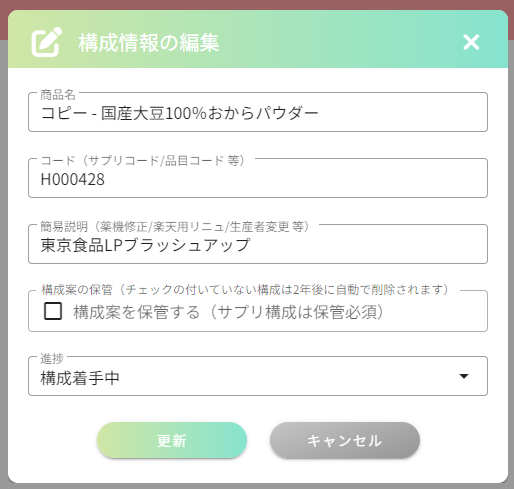

## HOME画面
### イメージ

##### 新規作成ダイアログ

##### 編集ダイアログ

### 画面概要説明
- LP構成の一覧表示、新規作成、編集

### 画面項目定義
##### 一覧
| No  | 項目名           | 項目種別         | 必須 | バリデーション | 初期値 | 選択肢 | 表示制御 | 備考                                                   |
| --- | ---------------- | ---------------- | ---- | -------------- | ------ | ------ | -------- | ------------------------------------------------------ |
| 1   | HOME             | ラベル           |      |                |        |        |          |                                                        |
| 2   | キーワードを入力 | ラベル           |      |                |        |        |          |                                                        |
| 3   | キーワード入力欄 | テキストボックス |      |                |        |        |          |                                                        |
| 4   | 新規作成ボタン   | ボタン           |      |                |        |        |          |                                                        |
| 5   | 一覧テーブル     | テーブル         |      |                |        |        |          | 行クリックでメニュー表示、押下した行の背景色を赤にする |
| 6   | ID               | ヘッダー         |      |                |        |        |          |                                                        |
| 7   | 商品名           | ヘッダー         |      |                |        |        |          |                                                        |
| 8   | コード           | ヘッダー         |      |                |        |        |          |                                                        |
| 9   | 💬                |                  |      |                |        |        |          |                                                        |
| 10  | 簡易説明         | ヘッダー         |      |                |        |        |          |                                                        |
| 11  | 💬                |                  |      |                |        |        |          |                                                        |
| 12  | 編集状況         | ヘッダー         |      |                |        |        |          |                                                        |
| 13  | 進捗             | ヘッダー         |      |                |        |        |          |                                                        |
| 14  | 開く             | ボタン           |      |                |        |        | メニュー |                                                        |
| 15  | コピー           | ボタン           |      |                |        |        | メニュー |                                                        |
| 16  | 編集             | ボタン           |      |                |        |        | メニュー |                                                        |
| 17  | 削除             | ボタン           |      |                |        |        | メニュー |                                                        |
##### 新規作成、編集ダイアログ
| No  | 項目名           | 項目種別         | 必須 | バリデーション | 初期値     | 選択肢                                                                                             | 表示制御 | 備考 |
| --- | ---------------- | ---------------- | ---- | -------------- | ---------- | -------------------------------------------------------------------------------------------------- | -------- | ---- |
| 18  | 新規作成         | ラベル           |      |                |            |                                                                                                    |          |      |
| 19  | 構成情報の編集   | ラベル           |      |                |            |                                                                                                    |          |      |
| 20  | ×                | ボタン           |      |                |            |                                                                                                    |          |      |
| 21  | 商品名           | テキストボックス | 〇   |                |            |                                                                                                    |          |      |
| 22  | コード           | テキストボックス | 〇   |                |            |                                                                                                    |          |      |
| 23  | 簡易説明         | テキストボックス |      |                |            |                                                                                                    |          |      |
| 24  | 構成案を保管する | チェックボックス |      |                |            | 構成案を保管する                                                                                   |          |      |
| 25  | 進捗             | プルダウン       |      |                | 構成着手中 | 構成着手中 構成薬機確認中 構成薬機確認済み(LP着手中) LP薬機確認中 LP薬機確認済 完了 |          |      |
| 26  | 登録             | ボタン           |      |                |            |                                                                                                    |          |      |
| 27  | 更新             | ボタン           |      |                |            |                                                                                                    |          |      |
| 28  | キャンセル       | ボタン           |      |                |            |                                                                                                    |          |      |

### 画面イベント
| No  | 項目No | 概要                                                     | 使用API名                                 | 使用vuex名 | 備考 |
| --- | ------ | -------------------------------------------------------- | ----------------------------------------- | ---------- | ---- |
| 1   |        | 一覧表示                                                 | get api/lp_easy_order/home                |            |      |
| 2   | 4      | 新規作成ダイアログ表示                                   |                                           |            |      |
| 3   | 18     | 新規作成                                                 | post api/lp_easy_order/home               |            |      |
| 4   |        | 行クリックでのメニュー表示                               |                                           |            |      |
| 5   | 16     | 編集ダイアログ表示                                       |                                           |            |      |
| 6   | 27     | 構成編集                                                 | put api/lp_easy_order/home/{lpOrderId}    |            |      |
| 7   | 15     | 構成コピー コピーで作成された構成名には「-コピー」とつく | post api/lp_easy_order/home/copy          |            |      |
| 8   | 17     | 構成の削除                                               | delete api/lp_easy_order/home/{lpOrderId} |            |      |
| 9   | 12     | 他ユーザーが編集中の構成には「編集中」と表示される       |                                           |            |      |
| 10  | 13     | 進捗に合わせて進捗バーが変化する                         |                                           |            |      |
| 11  |        | 編集ロック強制解除 ※詳しくは下記                         | delete api/lp_easy_order/lock/all/{id}    |            |      |

### 画面仕様
- 「編集中」と表示されている所に「Ctrl + Alt + 右クリック」で編集ロックを強制解除することが出来る
  - 編集中に停電が起きたり、何らかの理由で編集ロックを解除できずに画面が閉じられてしまった際に利用する
  - このコマンドは制作事業部部長とリーダーにのみ共有しています