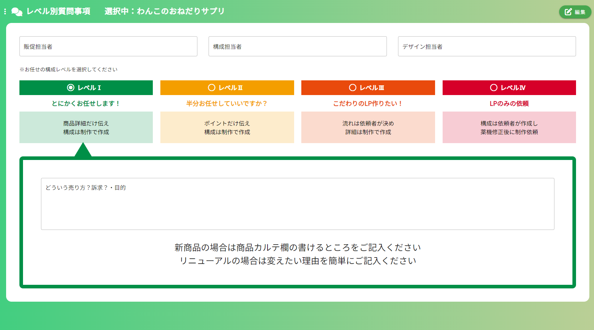
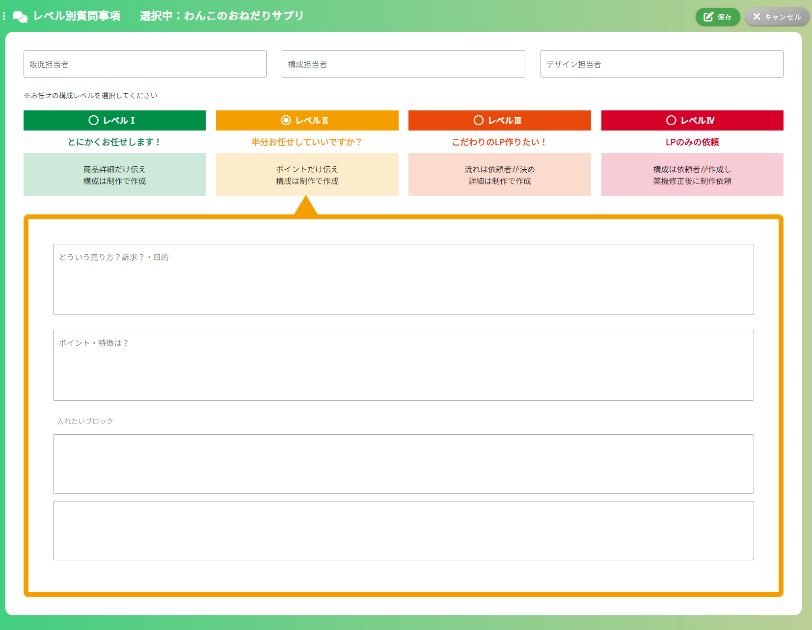
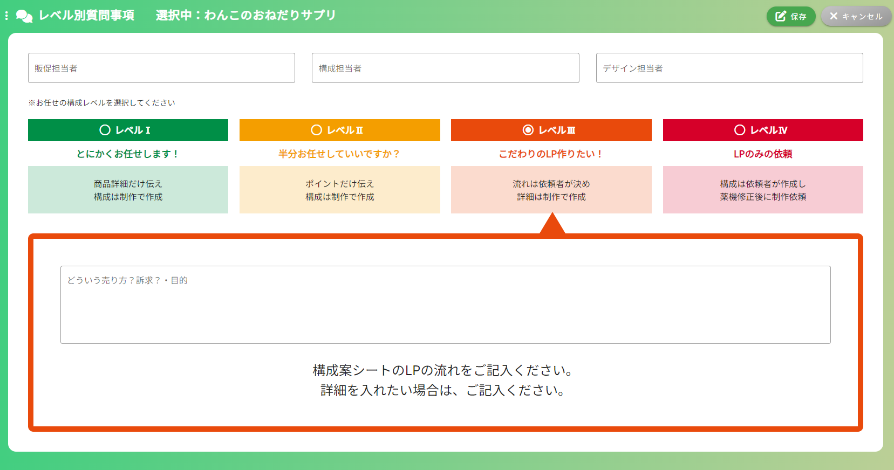
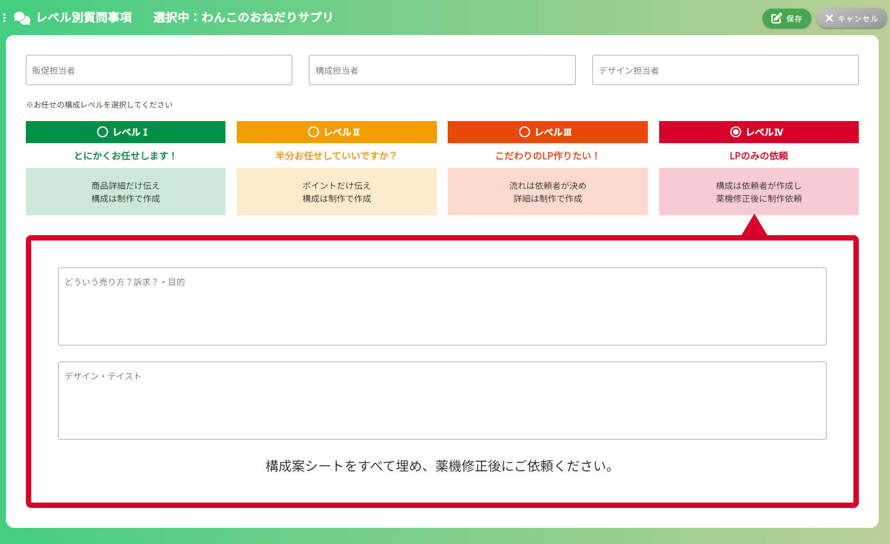

## レベル別質問事項画面
### イメージ
##### レベルⅠ

##### レベルⅡ

##### レベルⅢ

##### レベルⅣ

### 画面概要説明
- LP作成を依頼する際のレベル感を選択し、概要を入力する画面

### 画面項目定義
| No  | 項目名                                | 項目種別       | 必須 | バリデーション | 初期値 | 選択肢 | 表示制御             | 備考                     |
| --- | ------------------------------------- | -------------- | ---- | -------------- | ------ | ------ | -------------------- | ------------------------ |
| 1   | レベル別質問事項                      | ラベル         |      |                |        |        |                      |                          |
| 2   | 選択中：                              | ラベル         |      |                |        |        | 選択中の構成名を表示 | HOME画面以外の全画面共通 |
| 3   | 編集ボタン                            | ボタン         |      |                |        |        | 編集モード時非表示   | HOME画面以外の全画面共通 |
| 4   | 保存ボタン                            | ボタン         |      |                |        |        | 編集モード時のみ表示 | HOME画面以外の全画面共通 |
| 5   | キャンセルボタン                      | ボタン         |      |                |        |        | 編集モード時のみ表示 | HOME画面以外の全画面共通 |
| 6   | 販促担当者                            | ラベル         |      |                |        |        |                      |                          |
| 7   | 構成担当者                            | ラベル         |      |                |        |        |                      |                          |
| 8   | デザイン担当者                        | ラベル         |      |                |        |        |                      |                          |
| 9   | ※お任せの構成レベルを選択してください | ラベル         |      |                |        |        |                      |                          |
| 10  | レベルⅠ                               | ラジオボタン   |      |                |        |        |                      |                          |
| 11  | とにかくお任せします！                | ラベル         |      |                |        |        |                      |                          |
| 12  | 商品詳細だけ伝え～                    | ラベル         |      |                |        |        |                      |                          |
| 13  | どういう売り方？入力欄                | テキストエリア |      |                |        |        |                      |                          |
| 14  | 新商品の場合は～～                    | ラベル         |      |                |        |        |                      |                          |
| 15  | レベルⅡ                               | ラジオボタン   |      |                |        |        |                      |                          |
| 16  | 半分お任せしていいですか？            | ラベル         |      |                |        |        |                      |                          |
| 17  | ポイントだけ伝え 構成は制作で作成  | ラベル         |      |                |        |        |                      |                          |
| 18  | どういう売り方？入力欄                | テキストエリア |      |                |        |        |                      |                          |
| 19  | ポイント入力欄                        | テキストエリア |      |                |        |        |                      |                          |
| 20  | 入れたいブロック                      | ラベル         |      |                |        |        |                      |                          |
| 21  | ブロック入力欄                        | テキストエリア |      |                |        |        |                      |                          |
| 22  | 削除ボタン                            | ボタン         |      |                |        |        |                      |                          |
| 23  | ブロック追加バー                      | ボタン         |      |                |        |        |                      |                          |
| 24  | レベルⅢ                               | ラジオボタン   |      |                |        |        |                      |                          |
| 25  | こだわりのLP作りたい！                | ラベル         |      |                |        |        |                      |                          |
| 26  | 流れは依頼者で決め～                  | ラベル         |      |                |        |        |                      |                          |
| 27  | どういう売り方？入力欄                | テキストエリア |      |                |        |        |                      |                          |
| 28  | 構成案シートの～                      | ラベル         |      |                |        |        |                      |                          |
| 29  | レベルⅣ                               | ラジオボタン   |      |                |        |        |                      |                          |
| 30  | LPのみの依頼                          | ラベル         |      |                |        |        |                      |                          |
| 31  | 依頼構成は依頼者が作成し～            | ラベル         |      |                |        |        |                      |                          |
| 32  | どういう売り方？入力欄                | テキストエリア |      |                |        |        |                      |                          |
| 33  | デザイン・テイスト入力欄              | テキストエリア |      |                |        |        |                      |                          |
| 34  | 構成案シートを全て埋め～              | ラベル         |      |                |        |        |                      |                          |

### 画面イベント
| No  | 項目No      | 概要                                                     | 使用API名 | 使用vuex名                                     | 備考 |
| --- | ----------- | -------------------------------------------------------- | --------- | ---------------------------------------------- | ---- |
| 1   | 2           | 選択中の構成名表示                                       |           | common.getSelectedProductName                  |      |
| 2   | 3           | 編集モードに切り替える                                   |           |                                                |      |
| 3   | 5           | 編集モードキャンセル                                     |           |                                                |      |
| 4   |             | 内容検索                                                 |           | get api/lp_easy_order/level_select/{lpOrderId} |      |
| 5   | 10,15,24,29 | レベル選択時、入力内容変化                               |           |                                                |      |
| 6   | 23          | 入れたいブロック下部のバー押下時、その直下に入力欄を追加 |           |                                                |      |
| 7   | 22          | 入れたいブロックの削除                                   |           |                                                |      |
| 8   | 4           | 新規登録処理                                             |           | post api/lp_easy_order/level_select            |      |
| 9   | 4           | 更新処理                                                 |           | put api/lp_easy_order/level_select/{lpOrderId} |      |
※編集モード、閲覧モードに関しての詳細は、補足情報.md参照