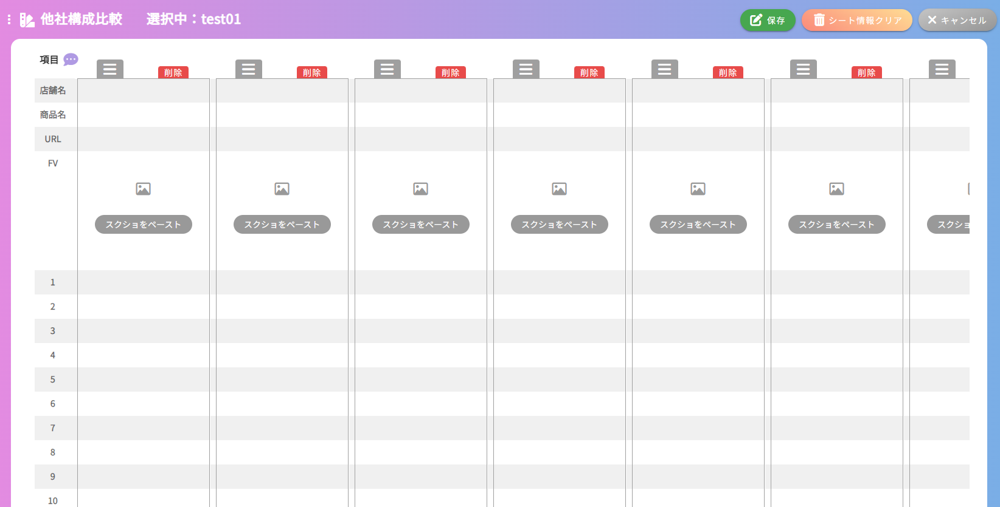

## 他社構成比較画面
### イメージ

##### ヘッダー編集ダイアログ

##### 削除確認ダイアログ

### 画面概要説明
- 作成するLPの商品に類似する他社の製品とを比較するために、各情報を入力する画面

### 画面項目定義
| No  | 項目名             | 項目種別 | 必須 | バリデーション | 初期値 | 選択肢 | 表示制御             | 備考                                           |
| --- | ------------------ | -------- | ---- | -------------- | ------ | ------ | -------------------- | ---------------------------------------------- |
| 1   | 商品カルテ入力     | ラベル   |      |                |        |        |                      |                                                |
| 2   | 選択中：           | ラベル   |      |                |        |        | 選択中の構成名を表示 | HOME画面以外の全画面共通                       |
| 3   | 編集ボタン         | ボタン   |      |                |        |        | 編集モード時非表示   | HOME画面以外の全画面共通                       |
| 4   | 保存ボタン         | ボタン   |      |                |        |        | 編集モード時のみ表示 | HOME画面以外の全画面共通                       |
| 5   | シート情報のクリア | ボタン   |      |                |        |        | 編集モード時のみ表示 | HOME画面、レベル別質問事項画面以外の全画面共通 |
| 6   | キャンセルボタン   | ボタン   |      |                |        |        | 編集モード時のみ表示 | HOME画面以外の全画面共通                       |
| 7   | ヘッダー           |          |      |                |        |        | 行の数だけ表示される |                                                |
| 8   | ヘッダー追加バー   |          |      |                |        |        | 行の数だけ表示される |                                                |
| 9   | セル               |          |      |                |        |        | 列の数だけ表示される | ヘッダーの種類で内容変化                       |
| 10  | 列追加バー         |          |      |                |        |        | 列の数だけ表示される |                                                |
| 11  | 削除ボタン            |          |      |                |        |        | 列の数だけ表示される |                                                |
| 12  | ≡                            | ラベル         |      |                |        |                                       |                                                    | このマークを上のみドラッグ可能                 |

##### ヘッダー編集ダイアログ
| No  | 項目名                         | 項目種別         | 必須 | バリデーション | 初期値       | 選択肢                           | 表示制御         | 備考                       |
| --- | ------------------------------ | ---------------- | ---- | -------------- | ------------ | -------------------------------- | ---------------- | -------------------------- |
| 13  | 項目の編集                     |                  |      |                |              |                                  |                  |                            |
| 14  | タイトル 入力欄                |                  |      |                |              |                                  |                  |                            |
| 15  | 画面選択チェックボックス       | チェックボックス |      |                | 他社比較入力 | 他社比較入力 他社構成比較     |                  | 他社構成比較は固定         |
| 16  | 種類ラジオボタン               | ラジオボタン     |      |                | テキスト     | テキスト url 画像 計算  |                  |                            |
| 17  | 計算ラジオボタン               | ラジオボタン     |      |                | 合計         | 合計 引き算 平均 割り算 |                  |                            |
| 18  | 対象項目選択プルダウン         | プルダウン       |      |                |              | 登録されているヘッダー           | 合計、平均時     |                            |
| 19  | 対象項目選択プルダウン 計算式1 |                  |      |                |              | 登録されているヘッダー           | 引き算、割り算時 | 引かれる、又は割られる対象 |
| 20  | 対象項目選択プルダウン 計算式2 |                  |      |                |              | 登録されているヘッダー           | 引き算、割り算時 | 引く、又は割る対象         |
| 21  | 更新                           | ボタン           |      |                |              |                                  |                  |                            |
| 22  | この項目を削除                 | ボタン           |      |                |              |                                  |                  |                            |

#### 削除確認ダイアログ
| No  | 項目名                         | 項目種別         | 必須 | バリデーション | 初期値       | 選択肢                           | 表示制御         | 備考                       |
| --- | ------------------------------ | ---------------- | ---- | -------------- | ------------ | -------------------------------- | ---------------- | -------------------------- |
| 23  | 削除確認                        | ラベル                 |      |                |              |                                  |                  |                            |
| 24  | x                              | ボタン                 |      |                |              |                                  |                  |                            |
| 25  | 本当に削除しますか               | ラベル                 |      |                |              |                                  |                  |                            |
| 26  | 削除                           | ボタン                 |      |                |              |                                  |                  |                            |
| 27  | キャンセル                     | キャンセル                 |      |                |              |                                  |                  |                            |

### 画面イベント
| No  | 項目No | 概要                                                   | 使用API名                                               | 使用vuex名 | 備考                                  |
| --- | ------ | ------------------------------------------------------ | ------------------------------------------------------- | ---------- | ------------------------------------- |
| 1   | 8      | ヘッダー、行の追加。                                   |                                                         |            | 追加時APIの都合上保存処理がかかる     |
| 2   | 7      | ヘッダーのダブルクリックで、編集ダイアログを表示できる |                                                         |            |                                       |
| 3   | 22     | ヘッダー、行の削除                                     |                                                         |            |                                       |
| 4   |        | 行の並べ替え                                           |                                                         |            | 並べ替え時APIの都合上保存処理がかかる |
| 5   | 12     | 列の並べ替え                                           |                                                         |            | 並べ替え時APIの都合上保存処理がかかる |
| 6   | 10     | 列の追加                                               |                                                         |            |                                       |
| 7   |        | 内容検索                                               | get api/lp_easy_order/comparison_insert/{lpOrderId}     |            |                                       |
| 8   |        | 登録                                                   | post api/lp_easy_order/constitution_process             |            | 初期表示時自動で行われる              |
| 9   | 4      | 更新                                                   | put api//lp_easy_order/constitution_process/{lpOrderId} |            |                                       |
| 10  | 5      | 入力値一括削除                                         | post api/lp_easy_order/constitution_process             |            | 初期表示時の情報で新規登録処理を行う  |
| 11  | 11      | 削除ダイアログ表示                                         |                                                      |            |                                     |
| 12  | 26      | 列削除                                                 |                                                         |            |                                    |

### 画面仕様
- 初期表示時、自動的に初期登録が行われる。(ヘッダーの初期値は固定)
  - 初期値：店舗名、商品名、URL、FV、1~20
- **他社比較入力画面と他社構成比較画面のデータは全て同じテーブルを参照している**
  - ヘッダー登録時の画面選択チェックボックスでどちらに表示させるかを選択する
  - そのため入力値一括削除を行うとどちらのデータも消えてしまうので注意
- ヘッダーの種類により、項目の値が変化する。項目の種類は下記の通り。
  - テキスト：プレーンテキスト
  - url：入力した値がリンクになる
  - 画像：画像をクリップボードから張り付けられる。クリックで拡大表示。
  - 計算：計算式を指定し、他のセルを計算させる
- セルの計算
  - 合計：他セルを複数選択でき、その合計を表示する
  - 引き算：2つのセルを選択でき、その差を表示する
  - 平均：他セルを複数選択でき、その平均を表示する
  - 割り算：2つのセルを選択でき、その商を表示する
- 画像の保存先：/storage/app/public/lp_order/{lpOrderId}/ComparisonInsert/