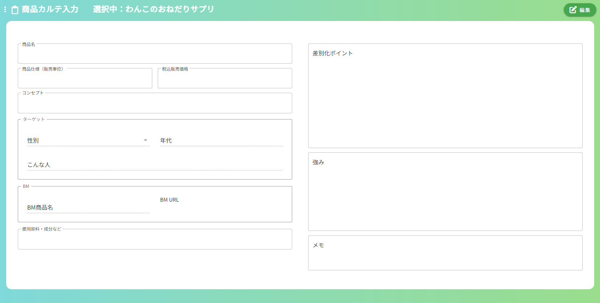

## 商品カルテ入力画面
### イメージ

### 画面概要説明
- 作成するLPの商品に関する基本情報やターゲット層の情報などを入力する画面

### 画面項目定義
| No  | 項目名                    | 項目種別                | 必須 | バリデーション | 初期値 | 選択肢 | 表示制御                                            | 備考                                           |
| --- | ------------------------- | ----------------------- | ---- | -------------- | ------ | ------ | --------------------------------------------------- | ---------------------------------------------- |
| 1   | 商品カルテ入力            | ラベル                  |      |                |        |        |                                                     |                                                |
| 2   | 選択中：                  | ラベル                  |      |                |        |        | 選択中の構成名を表示                                | HOME画面以外の全画面共通                       |
| 3   | 編集ボタン                | ボタン                  |      |                |        |        | 編集モード時非表示                                  | HOME画面以外の全画面共通                       |
| 4   | 保存ボタン                | ボタン                  |      |                |        |        | 編集モード時のみ表示                                | HOME画面以外の全画面共通                       |
| 5   | シート情報のクリア        | ボタン                  |      |                |        |        | 編集モード時のみ表示                                | HOME画面、レベル別質問事項画面以外の全画面共通 |
| 6   | キャンセルボタン          | ボタン                  |      |                |        |        | 編集モード時のみ表示                                | HOME画面以外の全画面共通                       |
| 7   | 商品名入力欄              | テキストエリア          |      |                |        |        |                                                     |                                                |
| 8   | 商品仕様(販売単価) 入力欄 | テキストエリア          |      |                |        |        |                                                     |                                                |
| 9   | 税込み販売価格 入力欄     | テキストエリア          |      |                |        |        |                                                     |                                                |
| 10  | コンセプト 入力欄         | テキストエリア          |      |                |        |        |                                                     |                                                |
| 11  | ターゲット                | テキストエリア          |      |                |        |        |                                                     |                                                |
| 12  | 性別 プルダウン           | プルダウン              |      |                |        |        |                                                     |                                                |
| 13  | 年代 入力欄               | テキストエリア          |      |                |        |        |                                                     |                                                |
| 14  | こんな人 入力欄           | テキストエリア          |      |                |        |        |                                                     |                                                |
| 15  | BM                        | ラベル                  |      |                |        |        |                                                     |                                                |
| 16  | BM商品名 入力欄           | テキストボックス        |      |                |        |        |                                                     |                                                |
| 17  | BM URL 入力欄             | テキストボックス リンク |      |                |        |        | URLが入力されている場合、閲覧モード中はリンクになる |                                                |
| 18  | 使用原料・成分など 入力欄 | テキストエリア          |      |                |        |        |                                                     |                                                |
| 19  | ×ボタン                   | ボタン                  |      |                |        |        |                                                     |                                                |
| 20  | 追加バー                  | ボタン                  |      |                |        |        |                                                     |                                                |
| 21  | 差別化ポイント 入力欄     | テキストエリア          |      |                |        |        |                                                     |                                                |
| 22  | 強み 入力欄               | テキストエリア          |      |                |        |        |                                                     |                                                |
| 23  | メモ 入力欄               | テキストエリア          |      |                |        |        |                                                     |                                                |

### 画面イベント
| No  | 項目No | 概要                           | 使用API名                                      | 使用vuex名 | 備考 |
| --- | ------ | ------------------------------ | ---------------------------------------------- | ---------- | ---- |
| 1   |        | 内容検索                       | get api/lp_easy_order/item_karte/{lpOrderId}   |            |      |
| 2   | 20     | 使用原料・成分など入力欄の追加 |                                                |            |      |
| 3   | 19     | 使用原料・成分など入力欄の削除 |                                                |            |      |
| 4   | 4      | 初期登録                       | post api/lp_easy_order/item_karte              |            |      |
| 5   | 4      | 更新                           | put api/lp_easy_order/item_karte/{itemKarteId} |            |      |
| 6   | 5      | 入力値一括削除                 |                                                |            |      |
※編集モード、閲覧モードに関しての詳細は、補足情報.md参照