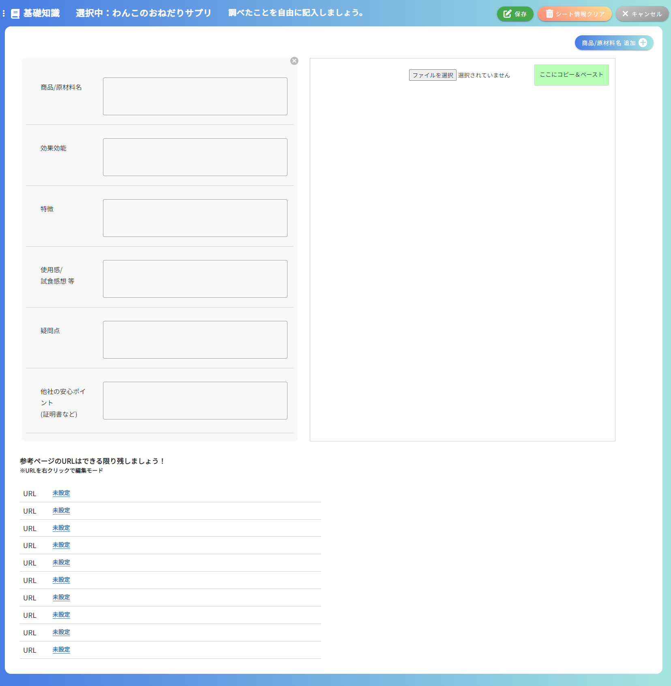

## 基礎知識画面
### イメージ

### 画面概要説明
- 作成するLPの商品に関する基礎知識を入力する画面

### 画面項目定義
| No  | 項目名                  | 項目種別                | 必須 | バリデーション | 初期値 | 選択肢 | 表示制御             | 備考                                           |
| --- | ----------------------- | ----------------------- | ---- | -------------- | ------ | ------ | -------------------- | ---------------------------------------------- |
| 1   | 基礎知識                | ラベル                  |      |                |        |        |                      |                                                |
| 2   | 選択中：                | ラベル                  |      |                |        |        | 選択中の構成名を表示 | HOME画面以外の全画面共通                       |
| 3   | 編集ボタン              | ボタン                  |      |                |        |        | 編集モード時非表示   | HOME画面以外の全画面共通                       |
| 4   | 保存ボタン              | ボタン                  |      |                |        |        | 編集モード時のみ表示 | HOME画面以外の全画面共通                       |
| 5   | シート情報のクリア      | ボタン                  |      |                |        |        | 編集モード時のみ表示 | HOME画面、レベル別質問事項画面以外の全画面共通 |
| 6   | キャンセルボタン        | ボタン                  |      |                |        |        | 編集モード時のみ表示 | HOME画面以外の全画面共通                       |
| 7   | 商品/原材料 追加ボタン  | ボタン                  |      |                |        |        |                      |                                                |
| 8   | 基礎知識タイトル 入力欄 | テキストエリア          |      |                |        |        | 基礎知識の数だけ表示 |                                                |
| 9   | 基礎知識内容 入力欄     | テキストエリア          |      |                |        |        | 基礎知識の数だけ表示 |                                                |
| 10  | ×ボタン(個別)           | ボタン                  |      |                |        |        | 基礎知識の数だけ表示 |                                                |
| 11  | 基礎知識追加バー        | ボタン                  |      |                |        |        | 基礎知識の数だけ表示 |                                                |
| 12  | ×ボタン(一列)           | ボタン                  |      |                |        |        |                      |                                                |
| 13  | ファイルを選択          | ボタン                  |      |                |        |        |                      |                                                |
| 14  | ここにコピー&ペースト   |                         |      |                |        |        |                      |                                                |
| 15  | 画像                    | 画像                    |      |                |        |        |                      |                                                |
| 16  | ゴミ箱ボタン            | ボタン                  |      |                |        |        |                      |                                                |
| 17  | メモ 入力欄             | テキストエリア          |      |                |        |        |                      |                                                |
| 18  | 参考ページのURL～～     | ラベル                  |      |                |        |        |                      |                                                |
| 19  | URL編集ボタン          | ボタン                  |      |                |        |        |                      |                                                |
| 20  | URL                     | ラベル                  |      |                |        |        |                      |                                                |
| 21  | URL 入力欄              | テキストボックス リンク |      |                | 未設定 |        |                      |                                                |
| 22  | URLテキスト 入力欄              | テキストボックス リンク |      |                | 未設定 |        |                      |                                                |

### 画面イベント　
| No  | 項目No | 概要                                                         | 使用API名                                                | 使用vuex名 | 備考 |
| --- | ------ | ------------------------------------------------------------ | -------------------------------------------------------- | ---------- | ---- |
| 1   |        | 内容検索                                                     | get api/lp_easy_order/basic_knowledge/{lpOrderId}        |            |      |
| 2   | 7      | 基礎知識エリアの追加                                         |                                                          |            |      |
| 3   | 12     | 基礎知識エリアの削除                                         |                                                          |            |      |
| 2   | 11     | 基礎知識の追加                                               |                                                          |            |      |
| 3   | 10     | 基礎知識の削除                                               |                                                          |            |      |
| 4   | 14     | スクショ画像を貼り付けすることでその画像とメモ欄が追加される |                                                          |            |      |
| 5   | 16     | 画像削除                                                     |                                                          |            |      |
| 6   | 19     | クリックすることでURL編集モードにできる        |                                                          |            |      |
| 7   | 4      | 保存                                                         | post api/lp_easy_order/basic_knowledge                   |            |      |
| 8   | 4      | 更新                                                         | put api/lp_easy_order/basic_knowledge/{BasicKnowledgeId} |            |      |
| 9   | 5      | 入力値一括削除(入力値を空にして更新処理)                     | put api/lp_easy_order/basic_knowledge/{BasicKnowledgeId} |            |      |
| 10  | 21,22      | 入力したテキストがリンクになる                     |                                                               |            |      |

### 画面仕様
- 画像の保存先：/storage/app/public/lp_order/{lpOrderId}/BasicKnowledge/