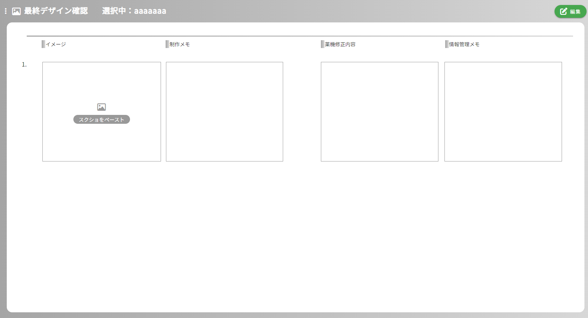

## 最終デザイン確認画面
### イメージ

### 画面概要説明
- 最終的に作成したLPを確認する画面

### 画面項目定義
| No  | 項目名                       | 項目種別 | 必須 | バリデーション | 初期値 | 選択肢 | 表示制御             | 備考                                           |
| --- | ---------------------------- | -------- | ---- | -------------- | ------ | ------ | -------------------- | ---------------------------------------------- |
| 1   | 商品カルテ入力               | ラベル   |      |                |        |        |                      |                                                |
| 2   | 選択中：                     | ラベル   |      |                |        |        | 選択中の構成名を表示 | HOME画面以外の全画面共通                       |
| 3   | 編集ボタン                   | ボタン   |      |                |        |        | 編集モード時非表示   | HOME画面以外の全画面共通                       |
| 4   | 保存ボタン                   | ボタン   |      |                |        |        | 編集モード時のみ表示 | HOME画面以外の全画面共通                       |
| 5   | シート情報のクリア           | ボタン   |      |                |        |        | 編集モード時のみ表示 | HOME画面、レベル別質問事項画面以外の全画面共通 |
| 6   | キャンセルボタン             | ボタン   |      |                |        |        | 編集モード時のみ表示 | HOME画面以外の全画面共通                       |
| 7   | ファイル内画像一括挿入ボタン |          |      |                |        |        |                      |                                                |
| 8   | イメージ                     |          |      |                |        |        |                      |                                                |
| 9   | 添え字                       |          |      |                |        |        |                      |                                                |
| 10  | 画像、ペーストエリア         |          |      |                |        |        |                      |                                                |
| 11  | ×ボタン(画像)                | ボタン   |      |                |        |        |                      |                                                |
| 12  | 制作メモ                     |          |      |                |        |        |                      |                                                |
| 13  | 制作メモ入力欄               |          |      |                |        |        |                      |                                                |
| 14  | 薬機修正内容                 |          |      |                |        |        |                      |                                                |
| 15  | 薬機修正内容入力欄           |          |      |                |        |        |                      |                                                |
| 16  | 情報管理メモ                 |          |      |                |        |        |                      |                                                |
| 17  | 情報管理メモ入力欄           |          |      |                |        |        |                      |                                                |
| 18  | ×ボタン                      |          |      |                |        |        |                      |                                                |
| 19  | 追加バー                     |          |      |                |        |        |                      |                                                |

### 画面イベント
| No  | 項目No | 概要                                                               | 使用API名                                                   | 使用vuex名 | 備考 |
| --- | ------ | ------------------------------------------------------------------ | ----------------------------------------------------------- | ---------- | ---- |
| 1   |        | 内容の検索                                                         | get api/lp_easy_order/final_design_confirmation/{lpOrderId} |            |      |
| 2   | 7      | 選択したフォルダ内の画像を一括挿入、各ブロックに一枚ずつ挿入される |                                                             |            |      |
| 3   | 4      | 画像のペースト                                                     |                                                             |            |      |
| 4   | 5      | 画像の削除                                                         |                                                             |            |      |
| 5   | 13     | 入力欄の追加                                                       |                                                             |            |      |
| 6   | 12     | 入力欄の削除                                                       |                                                             |            |      |
| 7   | 4      | 更新                                                               | put api/lp_easy_order/final_design_confirmation/{lpOrderId} |            |      |
| 8   | 5      | 入力値一括削除                                                     |                                                             |            |      |

### 画面仕様
- ファイル内画像一括挿入を行った場合、その画像の枚数分入力欄が追加される
- 制作メモ入力欄、薬機修正内容入力欄、情報管理メモ入力欄は全てリッチテキストエディタになっている
  - 選択した文字の色、大きさ、フォントなどが変更できる
- 画像の保存先：/storage/app/public/lp_order/{lpOrderId}/finaldesignconfirmation/