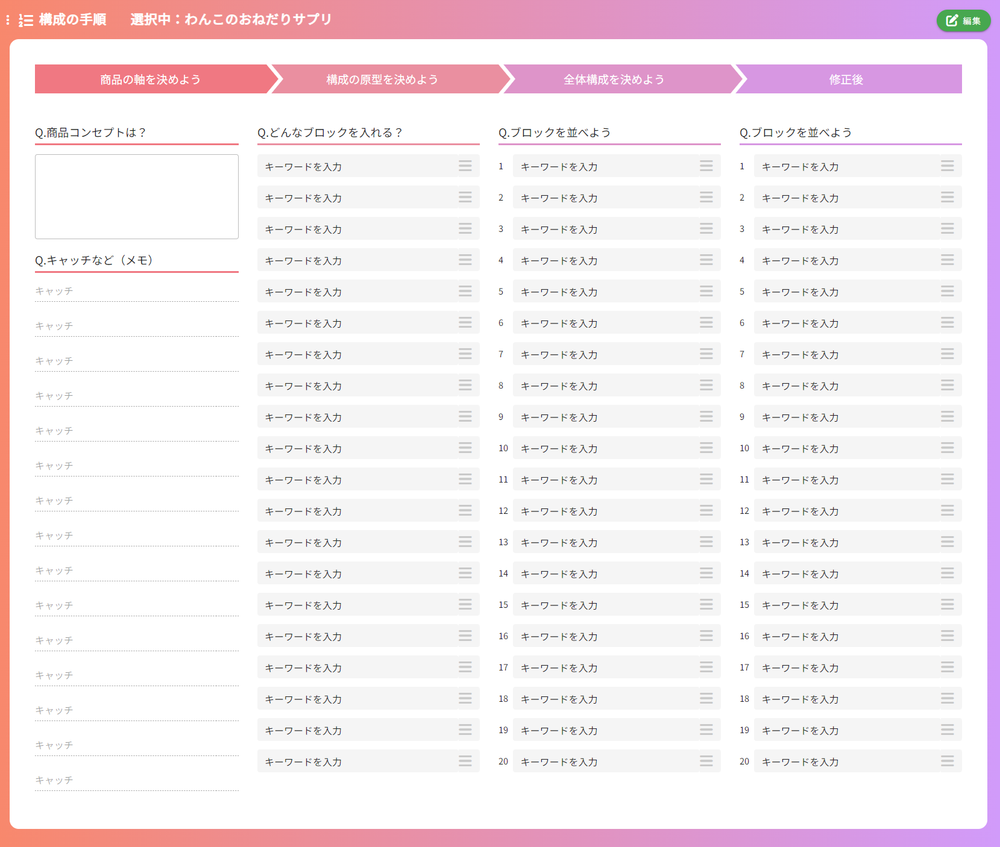

## 構成の手順画面
### イメージ

### 画面概要説明
- LP構成の各ブロックにどの様な内容で、どの順番で作成するかを表記する画面

### 画面項目定義
| No  | 項目名                     | 項目種別       | 必須 | バリデーション | 初期値 | 選択肢 | 表示制御                           | 備考                                           |
| --- | -------------------------- | -------------- | ---- | -------------- | ------ | ------ | ---------------------------------- | ---------------------------------------------- |
| 1   | 商品カルテ入力             | ラベル         |      |                |        |        |                                    |                                                |
| 2   | 選択中：                   | ラベル         |      |                |        |        | 選択中の構成名を表示               | HOME画面以外の全画面共通                       |
| 3   | 編集ボタン                 | ボタン         |      |                |        |        | 編集モード時非表示                 | HOME画面以外の全画面共通                       |
| 4   | 保存ボタン                 | ボタン         |      |                |        |        | 編集モード時のみ表示               | HOME画面以外の全画面共通                       |
| 5   | シート情報のクリア         | ボタン         |      |                |        |        | 編集モード時のみ表示               | HOME画面、レベル別質問事項画面以外の全画面共通 |
| 6   | キャンセルボタン           | ボタン         |      |                |        |        | 編集モード時のみ表示               | HOME画面以外の全画面共通                       |
| 7   | 商品の軸を決めよう         | ラベル         |      |                |        |        |                                    |                                                |
| 8   | Q.商品コンセプトは？       | ラベル         |      |                |        |        |                                    |                                                |
| 9   | 商品コンセプト入力欄       | テキストエリア |      |                |        |        |                                    |                                                |
| 10  | Q.キャッチなど(メモ)       | ラベル         |      |                |        |        |                                    |                                                |
| 11  | キャッチ入力欄             | テキストエリア |      |                |        |        |                                    |                                                |
| 12  | ×ボタン                    | ボタン         |      |                |        |        |                                    |                                                |
| 13  | 追加バー                   | ボタン         |      |                |        |        |                                    |                                                |
| 14  | 構成の原型を決めよう       | ラベル         |      |                |        |        |                                    |                                                |
| 15  | Q.どんなブロックを入れる？ | ラベル         |      |                |        |        |                                    |                                                |
| 16  | キーワード 入力欄          | テキストエリア |      |                |        |        |                                    |                                                |
| 17  | ≡                          | ラベル         |      |                |        |        |                                    | このマークを上のみドラッグ可能                 |
| 18  | ×ボタン                    | ボタン         |      |                |        |        |                                    |                                                |
| 19  | 追加バー                   | ボタン         |      |                |        |        |                                    |                                                |
| 20  | 全体構成を決めよう         | ラベル         |      |                |        |        |                                    |                                                |
| 21  | Q.ブロックを並べよう       | ラベル         |      |                |        |        |                                    |                                                |
| 22  | 添え字                     | ラベル         |      |                |        |        | 並べ替え後も自動で連番が付与される |                                                |
| 23  | キーワード 入力欄          | テキストエリア |      |                |        |        |                                    |                                                |
| 24  | ≡                          | ラベル         |      |                |        |        |                                    | このマークを上のみドラッグ可能                 |
| 25  | ×ボタン                    | ボタン         |      |                |        |        |                                    |                                                |
| 26  | 追加バー                   | ボタン         |      |                |        |        |                                    |                                                |
| 27  | 修正後                     | ラベル         |      |                |        |        |                                    |                                                |
| 28  | Q.ブロックを並べよう       | ラベル         |      |                |        |        |                                    |                                                |
| 29  | 添え字                     | ラベル         |      |                |        |        | 並べ替え後も自動で連番が付与される |                                                |
| 30  | キーワード 入力欄          | テキストエリア |      |                |        |        |                                    |                                                |
| 31  | ≡                          | ラベル         |      |                |        |        |                                    | このマークを上のみドラッグ可能                 |
| 32  | ×ボタン                    | ボタン         |      |                |        |        |                                    |                                                |
| 33  | 追加バー                   | ボタン         |      |                |        |        |                                    |                                                |

### 画面イベント
| No  | 項目No         | 概要                                           | 使用API名                                              | 使用vuex名 | 備考               |
| --- | -------------- | ---------------------------------------------- | ------------------------------------------------------ | ---------- | ------------------ |
| 1   |                | 内容検索                                       | get api/lp_easy_order/constitution_process/{lpOrderId} |            |                    |
| 2   | 13，19，26，33 | 各項目の追加、押下した項目の下に追加される     |                                                        |            |                    |
| 3   | 12，18，25，32 | 各項目の削除                                   |                                                        |            |                    |
| 4   | 17,24,31       | ブロックの並べ替え、左右のブロックにも移動可能 |                                                        |            |                    |
| 5   |                | 更新                                           | put api/lp_easy_order/companies_comparison/{lpOrderId} |            |                    |
| 6   |                | 入力値一括削除                                 | put api/lp_easy_order/companies_comparison/{lpOrderId} |            | 空データで更新処理 |

### 画面仕様
- 修正後欄のブロックは、初期表示時の構成案画面「ブロックの順番」タブに自動反映される