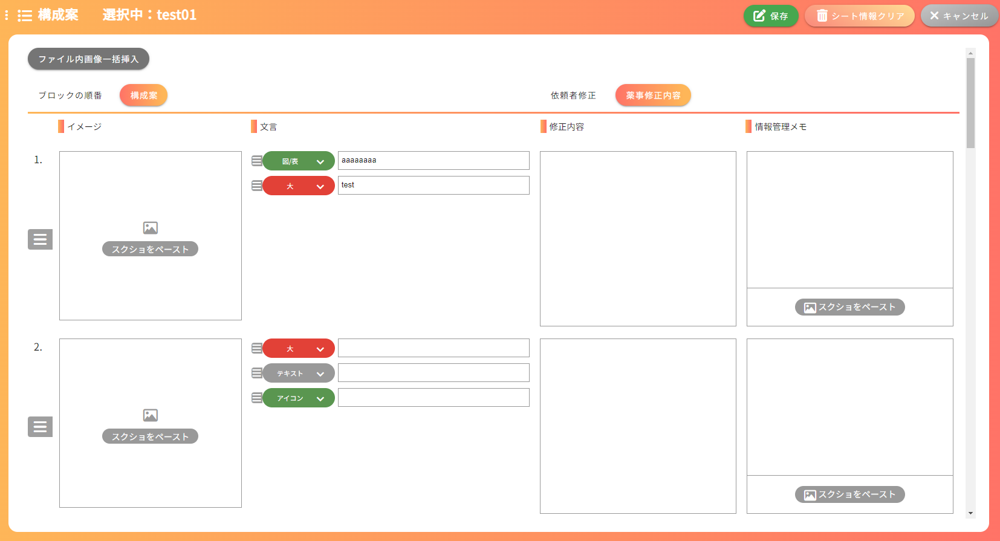
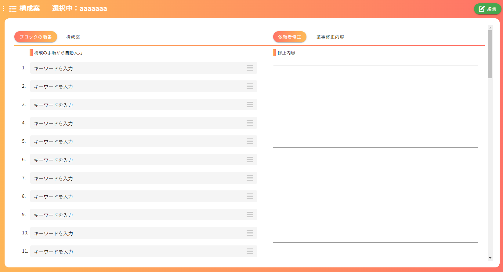

## 構成案画面
### イメージ
##### 構成案、薬事修正内容タブ

##### ブロックの順番、依頼者修正タブ

### 画面概要説明
- 構成の手順画面で作成した手順を元に、具体的なLPの案を作成する画面

### 画面項目定義
| No  | 項目名                       | 項目種別       | 必須 | バリデーション | 初期値 | 選択肢                                | 表示制御                                           | 備考                                           |
| --- | ---------------------------- | -------------- | ---- | -------------- | ------ | ------------------------------------- | -------------------------------------------------- | ---------------------------------------------- |
| 1  | 商品カルテ入力               | ラベル         |      |                |        |                                       |                                                    |                                                |
| 2  | 選択中：                     | ラベル         |      |                |        |                                       | 選択中の構成名を表示                               | HOME画面以外の全画面共通                       |
| 3  | 編集ボタン                   | ボタン         |      |                |        |                                       | 編集モード時非表示                                 | HOME画面以外の全画面共通                       |
| 4  | 保存ボタン                   | ボタン         |      |                |        |                                       | 編集モード時のみ表示                               | HOME画面以外の全画面共通                       |
| 5  | シート情報のクリア           | ボタン         |      |                |        |                                       | 編集モード時のみ表示                               | HOME画面、レベル別質問事項画面以外の全画面共通 |
| 6  | キャンセルボタン             | ボタン         |      |                |        |                                       | 編集モード時のみ表示                               | HOME画面以外の全画面共通                       |
| 7  | ファイル内画像一括挿入ボタン | ボタン         |      |                |        |                                       |                                                    |                                                |
| 8  | ブロックの順番               | タブ           |      |                |        |                                       |                                                    |                                                |
| 9  | 構成の手順から自動入力       | ラベル         |      |                |        |                                       |                                                    |                                                |
| 10  | 添え字                       | ラベル         |      |                |        |                                       | 並べ替え後も自動で連番が付与される                 |                                                |
| 11  | キーワード                   | テキストエリア |      |                |        |                                       |                                                    |                                                |
| 12  | ≡                            | ラベル         |      |                |        |                                       |                                                    | このマーク上のみドラッグ可能                 |
| 13  | ×ボタン                      | ボタン         |      |                |        |                                       |                                                    |                                                |
| 14  | 追加バー(構成)               | ボタン         |      |                |        |                                       |                                                    |                                                |
| 15  | 構成案                       | タブ           |      |                |        |                                       |                                                    |                                                |
| 16  | イメージ                     | ラベル         |      |                |        |                                       |                                                    |                                                |
| 17  | 添え字                       | ラベル         |      |                |        |                                       |                                                    |                                                |
| 18  | ≡                            | ラベル         |      |                |        |                                       |                                                    | このマーク上のみドラッグ可能 ver.○.○で追加                |
| 19  | 画像、ペーストエリア         |                |      |                |        |                                       |                                                    |                                                |
| 20  | ×ボタン(構成案画像)          | ボタン         |      |                |        |                                       |                                                    |                                                |
| 21  | 追加バー(構成案画像)         | ボタン         |      |                |        |                                       |                                                    |                                                |
| 22  | ≡                            | ラベル         |      |                |        |                                       |                                                    | このマーク上のみドラッグ可能 ver.○.○で追加                |
| 23  | 文言                         | ラベル         |      |                |        |                                       |                                                    |                                                |
| 24  | カテゴリプルダウン           | プルダウン     |      |                |        | 大,中,小,テキスト,アイコン,図/表,質問 | 選択肢以外にも自由に入力可能、その場合背景色は緑色 |                                                |
| 25  | 文言入力                     | テキストエリア |      |                |        |                                       |                                                    |                                                |
| 26  | ×ボタン(文言)                | ボタン         |      |                |        |                                       |                                                    |                                                |
| 27  | 追加バー(文言)               | ボタン         |      |                |        |                                       |                                                    |                                                |
| 28  | 依頼者修正                   | タブ           |      |                |        |                                       |                                                    |                                                |
| 29  | 依頼者修正入力欄             | テキストエリア |      |                |        |                                       |                                                    |                                                |
| 30  | 薬事修正内容                 | タブ           |      |                |        |                                       |                                                    |                                                |
| 31  | 修正内容                     | ラベル         |      |                |        |                                       |                                                    |                                                |
| 32  | 修正内容入力欄               | テキストエリア |      |                |        |                                       |                                                    |                                                |
| 33  | 情報管理メモ                 | ラベル         |      |                |        |                                       |                                                    |                                                |
| 34  | 情報管理メモ入力欄           | テキストエリア |      |                |        |                                       |                                                    |                                                |
| 35  | 画像、ペーストエリア         |                |      |                |        |                                       |                                                    |                                                |
| 36  | ×ボタン(情報管理画像)        | ボタン         |      |                |        |                                       |                                                    |                                                |
| 37  | ×ボタン(構成)                | ボタン         |      |                |        |                                       |                                                    |                                                |
| 38  | 追加バー(構成)               | ボタン         |      |                |        |                                       |                                                    |                                                |

### 画面イベント
| No  | 項目No | 概要                                                               | 使用API名                                           | 使用vuex名 | 備考               |
| --- | ------ | ------------------------------------------------------------------ | --------------------------------------------------- | ---------- | ------------------ |
| 1   |        | 内容の検索                                                         | get api/lp_easy_order/constitution_plan/{lpOrderId} |            |                    |
| 2   | 8      | ブロックの順番タブの表示                                           |                                                     |            |                    |
| 3   | 15     | 構成案タブの表示                                                   |                                                     |            |                    |
| 4   | 28     | 依頼者修正タブの表示                                               |                                                     |            |                    |
| 5   | 30     | 薬事修正内容タブの表示                                             |                                                     |            |                    |
| 6   | 7      | 選択したフォルダ内の画像を一括挿入、各ブロックに一枚ずつ挿入される |                                                     |            |                    |
| 7   | 14,38  | 構成の追加                                                         |                                                     |            |                    |
| 8   | 12     | 構成の並べ替え(ブロックの順番タブ)                                                     |                                                     |            |                    |
| 9   | 13,37  | 構成の削除                                                         |                                                     |            |                    |
| 10  | 18,35  | 画像のペースト                                                     |                                                     |            |                    |
| 11  | 20     | ペーストエリアの追加                                               |                                                     |            |                    |
| 12  | 19     | ペーストエリアに画像がある場合その画像の削除                       |                                                     |            |                    |
| 13  | 19     | ペーストエリアに画像がない場合、ペーストエリア自体の削除           |                                                     |            |                    |
| 14  | 27     | カテゴリプルダウン、文言の追加                                     |                                                     |            |                    |
| 15  | 26     | カテゴリプルダウン、文言の削除                                     |                                                     |            |                    |
| 16  | 35     | 情報管理メモ欄の画像ペースト                                       |                                                     |            |                    |
| 17  | 4      | 更新                                                               | put api/lp_easy_order/constitution_plan/{lpOrderId} |            |                    |
| 18  | 5      | 入力値一括削除                                                     | put api/lp_easy_order/constitution_plan/{lpOrderId} |            | 空データで更新処理 |
| 19   | 18     | 構成の並べ替え(構成案タブ)                                          |                                                     |            |                    |
| 20   | 22     | 文言エリアの並べ替え                                                |                                                     |            |                    |

### 画面仕様
- 初期表示時は構成案、薬事修正内容タブが選択された状態
- ブロックの順番、構成案、依頼者修正、薬事修正内容の並びや数は連動している
  - 例えばブロックの順番タブでブロックの位置の入れ替え、追加、削除した場合は他タブでも反映される。
- ブロックの順番タブの内容は初期表示時、構成案の修正後欄の内容と連動している
  - 一度構成案の内容を保存したら、連動されなくなる
- 構成案タブの文言、依頼者修正、薬事修正内容のテキストエディタはリッチテキストエディタになっている
  - 選択した文字の色、大きさ、フォントなどが変更できる
- 構成案の数は初期値では12個になっており、ファイル内画像一括追加で12枚以上の画像を挿入した際は、構成案の数はその画像分増える
- HOME画面で設定する構成の進捗が「構成薬機確認中」「LP薬機確認中」の場合、構成案タブの文言、依頼者修正タブ、薬事修正内容タブ、以外が入力不可になる
- 画像の保存先：/storage/app/public/lp_order/{lpOrderId}/ConstitutionPlan/